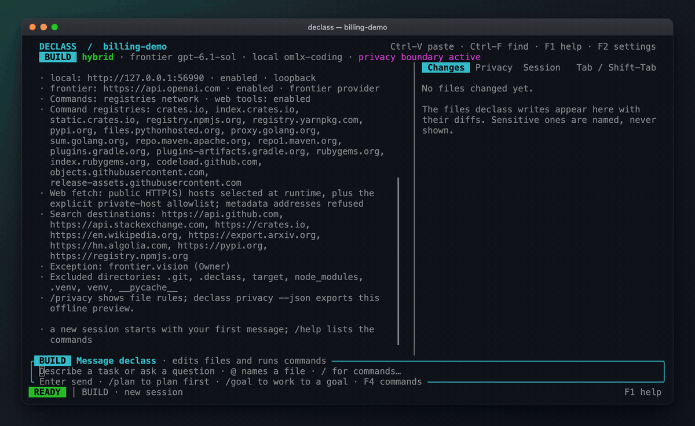
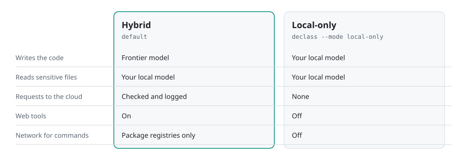

<div align="center">


# Declass

**Frontier AI coding. Private context stays local.**

Declass is a terminal coding agent where the cloud model never sees your sensitive data. The cloud model writes the code, and a local model on your machine reads that data and answers its questions.

Most coding agents send everything they read to the cloud, including `.env` files, customer data, and logs. With Declass, when the cloud model needs something from your sensitive data, it has to ask the local model. Declass checks every answer before it leaves, so secrets and raw data stay put.

It still does everything you'd expect from a coding agent, from editing files to running tests to working through tasks end to end. It just does it without handing over the parts of your codebase you can't afford to share.

[](https://github.com/maximpri/declass/releases/latest)
[](LICENSE)
[](docs/INSTALLATION.md)



<sub>A real session on fictional customer data. The bug is fixed, the tests pass, and none of the 13 planted secrets appear in the 5 requests sent to the cloud. Agent work plays at 6× speed. <a href="docs/evidence/recorder-billing-2026-10-06/README.md">Recording and evidence</a></sub>

</div>

Running everything locally would avoid sending anything, but local models are still well behind the best cloud models at writing code. Declass gives you the cloud model's coding and keeps the private context on your machine, with a record of exactly what was sent.

## Install

macOS and Linux, on ARM64 or x86-64:

```sh
curl -fsSL https://raw.githubusercontent.com/maximpri/declass/main/install.sh | bash
```

This installs `declass` to `~/.local/bin` and adds it to your `PATH` (pass `--no-modify-path` to skip that). No `sudo` or Rust toolchain needed. Releases are signed with the [Declass release key](docs/declass-release.pub). This one-line installer checks checksums, which catch corrupted downloads; to also check the signature, add the key to your allowed signers first ([how](docs/INSTALLATION.md#signed-releases)). For disk images, building from source or verifying signatures, see the [installation guide](docs/INSTALLATION.md).

## Quick start

Open a new terminal in your project and run:

```sh
declass
```

Declass has no default models and sends nothing until you choose them. The first time, it opens a setup screen: it shows the API keys in your environment and the model servers on your machine, you pick the cloud model and the local model (or a server elsewhere on your network), review, and save. `declass setup` opens it again. If you don't have a local model yet, install [Ollama](https://ollama.com) and pull one (for example `ollama pull qwen3:8b`), then run `declass doctor --online` to check its context window is big enough.

No API key? A ChatGPT Plus or Pro plan works instead:

```sh
declass login chatgpt                     # sign in with your browser and allow Declass to use your plan
declass config preset chatgpt --confirm   # send the cloud model's requests through your plan
```

Requests go to OpenAI's public API and count against your plan's usage, which you can limit in [ChatGPT settings](https://chatgpt.com/settings/usage). `declass logout chatgpt` signs out.

Then describe the task:

```text
the billing export counts inactive customers in active_total, fix it
```

To make Declass keep going until your tests pass:

```sh
declass --check 'npm test' "fix the failing export tests"
```

## How it works

<picture>
  <source media="(prefers-color-scheme: dark)" srcset="docs/assets/infographics/declass-flow-dark.svg">
  
</picture>

- Ordinary code is sent to the cloud model as it is. Files that match your sensitive patterns (by default `.env*`, keys, `data/**`, CSVs, databases and logs) are not. The cloud model gets their structure (column names, value types, synthetic example rows) and can ask your local model specific questions about them.
- Everything that goes out, including the local model's answers, is checked against the private values Declass has seen. Secrets and personal data are replaced with placeholders such as `⟨secret:URL_PASSWORD#1⟩`. The local model can't approve its own answers.
- Commands run in an OS sandbox (Seatbelt on macOS, bubblewrap on Linux) with network access limited to package registries.
- The Changes panel shows the diff. The Privacy panel shows each request and what was filtered from it. `declass audit show <run>` prints the full log, which is hash-chained so you can check it hasn't been altered.

This doesn't make leaks impossible. Declass blocks known private values, and the local model also checks its answers for paraphrased details, but that check is a model's judgement, and an answer like "3 customers are overdue" still goes out by design. [What is and isn't covered](docs/SECURE_BY_DESIGN.md)

## Modes

<picture>
  <source media="(prefers-color-scheme: dark)" srcset="docs/assets/infographics/declass-modes-dark.svg">
  
</picture>

Hybrid is the default. `declass --mode local-only` keeps everything on your machine, at the cost of coding quality.

Within a session, the badge in the header shows what Declass will do with your next message:

- **BUILD**: edits files and runs commands. This is the normal mode.
- **PLAN**: `/plan <task>` investigates with read-only tools and saves a plan you can review, edit and approve. `/plan implement rN` carries it out.
- **GOAL**: `/goal <outcome>` keeps working across turns until the goal is met or its turn limit runs out.

## Benchmark

<picture>
  <source media="(prefers-color-scheme: dark)" srcset="docs/assets/infographics/declass-results-dark.svg">
  
</picture>

I ran nine coding tasks, each containing planted private data (customer records, credentials, logs, proprietary pricing), three times with Declass and three times with the same cloud model and no protection. Hidden tests scored the code. Here is every run:

<picture>
  <source media="(prefers-color-scheme: dark)" srcset="docs/assets/infographics/declass-results-by-task-dark.svg">
  
</picture>

Most of the gap between the two averages comes from two Declass runs that scored zero: one produced code that didn't compile, and one was stopped at its time limit. Both are counted.

The privacy check looks for complete planted values (also base64, hex and URL-encoded) in the recorded requests. It can't detect a secret leaked in pieces or paraphrased. The tasks are mine, it's one cloud model, and three runs per task is a small sample. [Method and full evidence](docs/evidence/benchmark-54-2026-10-04/README.md) · [Results as a table](docs/DECLASS_VISUAL_GUIDE.md#results-by-task) · [Raw data](docs/evidence/benchmark-54-2026-10-04/report.json)

## Usage

```sh
declass                                 # start a session
declass "fix the failing export"        # start with a task
declass --check 'cargo test' "fix it"   # finish only when the check passes
declass --mode local-only               # use only your local model
declass --resume                        # continue the last session
declass run "fix the export"            # run once without a conversation
declass privacy                         # show what's sensitive and where requests go
declass audit show <run>                # show everything a run sent to the cloud
declass doctor                          # check your setup
```

To give private code less exposure, list it in `.declass/config.toml`:

```toml
[sensitivity]
protected_paths = ["src/billing/**"]   # read only by the local model

[ip]
interface_only = ["src/pricing/**"]    # the cloud model sees signatures, not bodies
sealed = ["src/risk_model/**"]         # the cloud model only knows the files exist
```

Every session also has a cap on frontier requests, and F2 opens the settings. Declass works with MCP servers, language servers, web search and `SKILL.md` skills, all behind the same checks. [Usage guide](docs/USAGE.md)

## Models

Cloud: Anthropic, OpenAI, Google Gemini, OpenRouter, z.ai, DeepSeek, xAI, Mistral, Groq, Cerebras, Together, Fireworks and Qwen, or any OpenAI-compatible endpoint. With a ChatGPT Plus or Pro plan you can skip the API key: `declass login chatgpt` ([details](docs/USAGE.md#chatgpt-plan)).

Local: Ollama, LM Studio, llama.cpp, vLLM, oMLX, MLX, Jan, GPT4All, KoboldCpp, LocalAI and LiteLLM. The local model needs a context window of about 40K tokens. In hybrid mode it only reads and answers questions, so it doesn't need to be good at coding.

## Status

Declass is an early release. It has over 1,300 tests and fuzzing, and its Rust code forbids `unsafe`, but it hasn't had an outside security review. Read [the security design](docs/SECURE_BY_DESIGN.md) before using it with real regulated data.

Bug reports and "it didn't work on my setup" reports help the most right now: [open an issue](https://github.com/maximpri/declass/issues). I'll accept code contributions once the contributor agreement is published ([details](CONTRIBUTING.md)). Report vulnerabilities privately through a [security advisory](https://github.com/maximpri/declass/security/advisories/new) ([policy](SECURITY.md)).

## License

Copyright (C) 2026 Maxim Priezjev. Licensed under [GPL-3.0-or-later](LICENSE). Release archives include the corresponding source and third-party notices ([licensing](LICENSES.md)).
